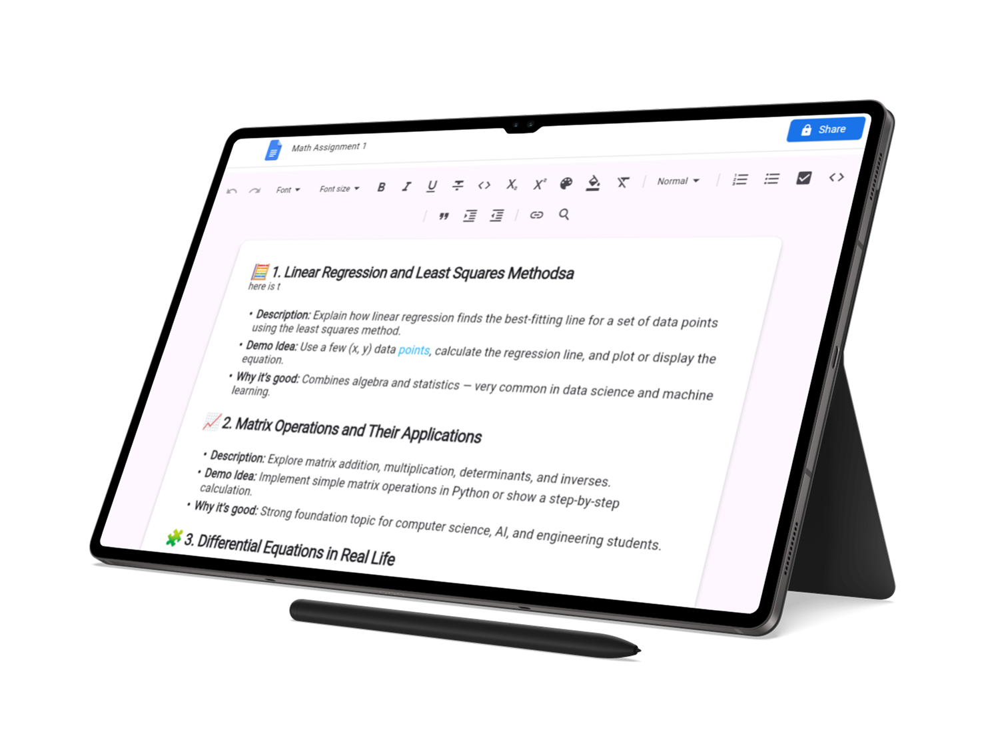

# Flutter Google Docs Clone

  

  The Google Docs Clone project is a collaborative document editor built with Flutter and Node.js. It allows multiple users to create, edit, and share documents in real-time, similar to Google Docs — all synchronized through WebSockets.

<!-- Buttons -->

  <!--  -->
  &nbsp;&nbsp;&nbsp;&nbsp;
  

<!-- Device image -->

  

 

  

 

This Flutter + Node.js project replicates the core features of Google Docs, including real-time collaborative editing, document sharing, and user authentication via Google Sign-In.  
Each user can manage their own documents, and all edits are synchronized instantly using WebSockets for seamless teamwork.

You can easily extend it by integrating more features like version history, comments, or export options.  
The UI is responsive and supports both web and desktop platforms.

---
